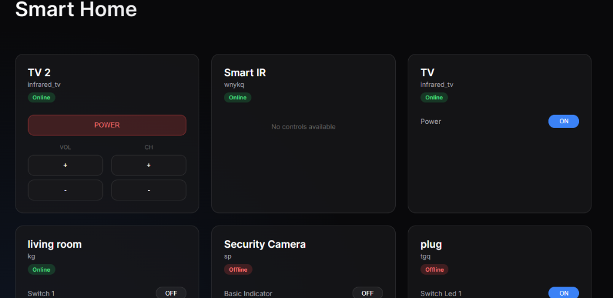

<div align="center">


# 🏠 Tuya Smart Home Web Dashboard

**A premium, high-performance web interface for your Tuya IoT ecosystem.**

[](https://nextjs.org/)
[](https://www.typescriptlang.org/)
[](https://developer.tuya.com/)

[🚀 Features](#-features) • [📦 Installation](#-installation) • [⚙️ Configuration](#-configuration) • [📸 Screenshots](#-screenshots) • [👤 Author](https://github.com/linux2z)

</div>

---

## ✨ Features

- 💎 **Modern Aesthetics**: Sleek dark-mode interface using Glassmorphism and Outfit typography.
- 📡 **Real-time Control**: Instant toggle for switches and plugs.
- 📺 **Advanced TV Remote**: Special Infrared (IR) interface for volume, channel, and power control.
- 🎚️ **Dynamic Sliders**: Built-in support for brightness, volume, and temperature adjustments.
- ⚡ **Auto-Discovery**: Automatically fetches and categorizes your entire device list.
- 🛡️ **Reliable Connection**: Built-in retry logic to handle cloud-side connection blips gracefully.

---

## 📸 Screenshots

<div align="center">
  
  <p><i>Live Dashboard featuring Infrared TV controls and lighting switches.</i></p>
</div>

---

## 🚀 Installation

### 1. Clone & Install
```bash
git clone https://github.com/linux2z/tuya-smart-home.git
cd tuya-smart-home
npm install
```

### 2. Configuration
Create a `.env.local` file in the root and fill in your Tuya Developer credentials:

```env
TUYA_ACCESS_ID=your_id
TUYA_ACCESS_SECRET=your_secret
TUYA_UID=your_uid
TUYA_API_ENDPOINT=https://openapi.tuyaeu.com
```

> [!TIP]
> **Endpoint Guide:**
> - Western America: `https://openapi.tuyas.com`
> - Central Europe: `https://openapi.tuyaeu.com`
> - China: `https://openapi.tuyacn.com`

### 3. Start Development
```bash
npm run dev
```
Visit **[localhost:3000](http://localhost:3000)** to start controlling your home!

---

## 📂 Architecture

- **`/src/app`**: Next.js App Router providing a dynamic, responsive dashboard.
- **`/src/lib`**: Core logic including Tuya SDK initialization and API wrappers.
- **`/scripts`**: Utility scripts for system health and device inspection:
  - `test-connection.ts`: Validate your Tuya API credentials.
  - `inspect-devices.js`: Detailed dump of all connected device capabilities.
  - `inspect-tv.js`: Specific diagnosis for Infrared (IR) remote functionalities.

---

<div align="center">
  <p>Built by <a href="https://github.com/linux2z">linux2z</a></p>
  <p>Made with ❤️ for the Smart Home Community</p>
</div>
